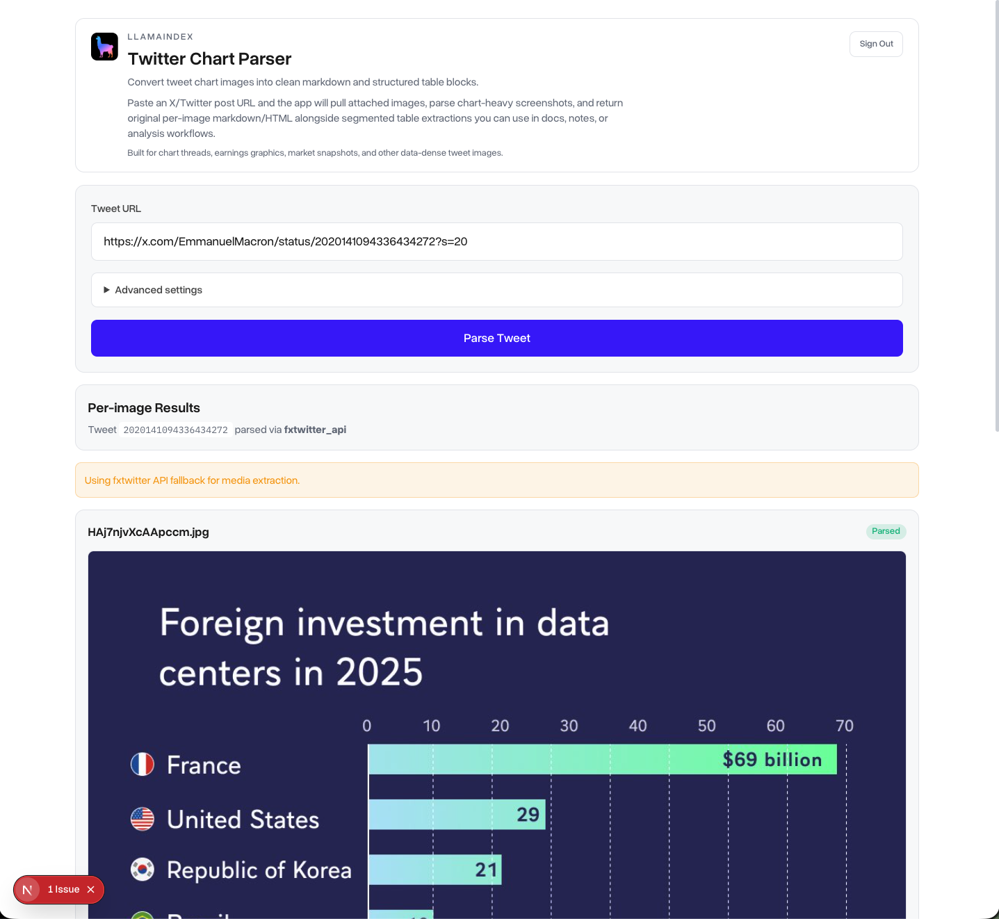
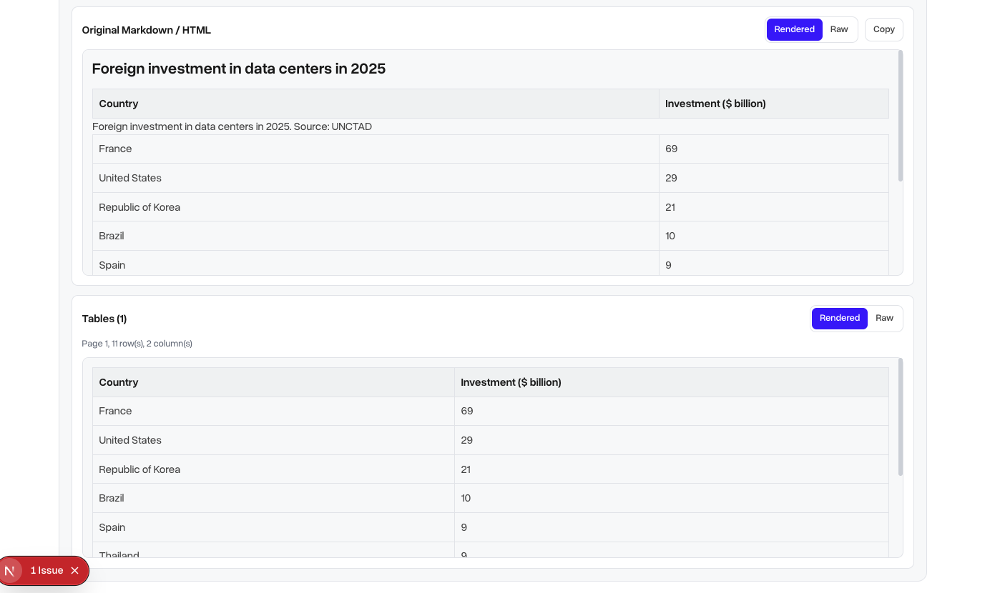

# Twitter Chart Parser

Convert chart-heavy X/Twitter post images into clean markdown and structured tables using LlamaParse on LlamaCloud.

> New to LlamaCloud? **[Sign up for LlamaCloud](https://cloud.llamaindex.ai/)** to get an API key (`llx-...`) and run this app.

## What This App Does
- Accepts an X/Twitter post URL.
- Pulls image attachments from the post.
- Parses each image into:
  - original markdown/HTML-style content
  - segmented table blocks for downstream analysis
- Returns per-image results so you can inspect and export data cleanly.

Built for chart threads, earnings snapshots, macro dashboards, and other data-dense tweet images.

## Quick Walkthrough
1. Create a LlamaCloud account if you do not have one yet: **[Sign up here](https://cloud.llamaindex.ai/)**.
2. Open the app and enter your LlamaCloud API key plus the tweet URL on the same screen.
3. Click **Parse Tweet**.
4. Review the per-image markdown/HTML output and extracted table blocks.

### Input + Parse Flow


### Rendered Output + Extracted Tables


## Getting Started (Local)

### LlamaCloud Account (Required)
This app requires a LlamaCloud API key for parsing.

1. Sign up at **[cloud.llamaindex.ai](https://cloud.llamaindex.ai/)**.
2. Create an API key in your LlamaCloud dashboard.
3. Use that key in the app input (`llx-...`).

### Prerequisites
- Python 3.11+
- Node.js 18+

### 1) Start Backend
```bash
cd backend
python3 -m venv .venv
source .venv/bin/activate
pip install -r requirements.txt
uvicorn main:app --reload
```

Backend runs at `http://localhost:8000`.

### 2) Start Frontend
```bash
cd web
npm install
npm run dev
```

Frontend runs at `http://localhost:3000`.

If needed, set the frontend API URL:

```bash
export NEXT_PUBLIC_API_URL=http://localhost:8000
```

## Deployment (Vercel + Render)

This repo is designed to deploy as two services:
- Frontend (`web/`) on Vercel
- Backend (`backend/`) on Render

Required environment variables:
- Backend (Render): `CORS_ORIGINS` (comma-separated frontend origins)
- Frontend (Vercel): `NEXT_PUBLIC_API_URL` (public backend URL)

Deployment config/templates in this repo:
- `render.yaml`
- `backend/.env.example`
- `web/.env.example`

Detailed runbook:
- `docs/deployment/vercel-render.md`

## API Overview
- `POST /validate-llama-key`: Validate a LlamaCloud API key.
- `POST /extract-tweet-images`: Extract image URLs from a tweet/post.
- `POST /parse-tweet`: Extract and parse all tweet images to markdown/tables.
- `GET /health`: Health check.

## Tech Stack
- Frontend: Next.js + React + TypeScript
- Backend: FastAPI + Python

## Project Structure

```text
twitter_chart_parser/
├── backend/
│   ├── api/
│   ├── services/
│   ├── tests/
│   ├── main.py
│   └── requirements.txt
├── web/
│   ├── src/app/
│   ├── src/components/
│   ├── src/lib/
│   └── src/types/
├── docs/images/
├── plans/
└── research/
```

## Troubleshooting
- `NO_MEDIA_FOUND` during extraction:
  - The post may be private, deleted, rate-limited, or not image-based.
  - Add an X bearer token for more reliable extraction.
- Llama key validation fails:
  - Ensure the key starts with `llx-`.
  - Confirm network access to `api.cloud.llamaindex.ai`.
- Parse request is slow:
  - Use a lower parse tier (`agentic`).
  - Try posts with fewer attached images.

## Reliability Notes
- Without X API credentials, media extraction is best-effort (syndication/meta fallbacks).
- Current scope is image attachments (not video/GIF extraction).
